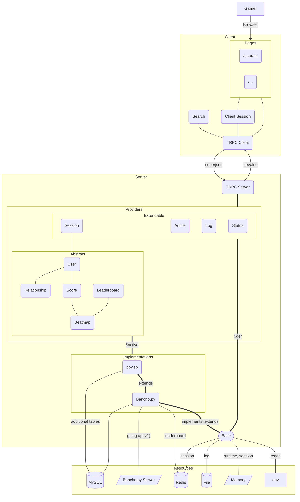

## Overview

Guccho is a Nuxt 3-based web frontend for private osu! servers. It uses a layered architecture with backend adapters to support different server implementations while maintaining a consistent API through TRPC.

## Architecture Diagram

The following diagram illustrates how data flows through Guccho's architecture:



## Project Structure

### Backend Structure

The server-side code is organized in `/src/server/`:

```
src/server/
├── backend/              # Backend adapter system
│   ├── $base/           # Base provider definitions
│   ├── bancho.py/       # bancho.py implementation
│   └── ppy.sb@bancho.py/  # ppy.sb extension
├── trpc/                # TRPC router configuration
│   ├── routers/         # API endpoints
│   ├── middleware/      # Auth & session middleware
│   └── trpc.ts          # TRPC initialization
└── api/trpc/            # Nuxt API handler
```

### Key Directories

- **`backend/$base/`**: Abstract base providers that define interfaces for all server functionality
- **`backend/bancho.py/`**: Concrete implementation for bancho.py servers
- **`backend/ppy.sb@bancho.py/`**: Extended implementation for ppy.sb
- **`trpc/routers/`**: API route definitions (user, score, map, etc.)
- **`trpc/middleware/`**: Request pipeline components (session, auth, roles)

## Abstraction Layers

### $base Layer

The `$base` directory contains abstract provider classes that define the contract for backend implementations:

```typescript
// Example: UserProvider in $base/server/user.ts
export abstract class UserProvider<Id, ScoreId> extends IdTransformable {
  abstract uniqueIdent(input: string): Promise<boolean>
  abstract getCompact(opt: UserProvider.OptType & { scope: Scope }): Promise<UserCompact<Id>>
  abstract testPassword(opt: UserProvider.OptType, password: string): Promise<[boolean, UserCompact<Id>]>
  // ... more abstract methods
}
```

**Key providers include:**

- `UserProvider` - User management and authentication
- `ScoreProvider` - Score queries and leaderboards
- `MapProvider` - Beatmap data
- `SessionProvider` - Session storage
- `ArticleProvider` - News/article content
- `RankProvider` - Rankings and statistics

### $active Adapter

The `$active` alias points to the currently active backend adapter configured in `guccho.backend.config.ts`:

```typescript
export default {
  use: 'ppy.sb@bancho.py',  // Determines which adapter is $active
  // ...
} satisfies UserBackendConfig
```

Code imports from `$active` to access the active adapter's implementation:

```typescript
import { UserProvider, features } from '$active'
```

## Data Flow

### Client to Server

1. **User Action**: User interacts with a page component
2. **TRPC Client**: Component calls TRPC procedure via the client
3. **HTTP Transport**: Request sent with superjson serialization
4. **TRPC Server**: Handler receives request, runs middleware
5. **Provider Call**: Router invokes backend provider method
6. **Data Source**: Provider queries MySQL/Redis/API as needed
7. **Response**: Data flows back through the same chain

### Example Flow

```typescript
// Client (page component)
const { data } = await trpc.user.userpage.useQuery({ handle: 'peppy' })

// Server (TRPC router)
router.userpage.query(async ({ input: { handle }, ctx }) => {
  const user = await users.getFull({ handle })  // Uses $active provider
  return mapId(user, UserProvider.idToString)
})

// Provider (backend adapter)
class UserProvider extends Base {
  async getFull({ handle }) {
    // Query MySQL, transform data
    return toFullUser(dbResult)
  }
}
```

## Configuration System

Guccho uses two main configuration files:

### Backend Configuration

`guccho.backend.config.ts` configures the server adapter and data sources:

```typescript
export default {
  use: 'ppy.sb@bancho.py',  // Choose backend adapter
  sessionStore: 'redis',
  leaderboardSource: 'database',
  redisURL: env('REDIS_URL'),
  dsn: env('DB_DSN'),
  avatar: {
    location: resolve('.dump/ppy.sb/avatar'),
    domain: 'a.ppy.sb',
  },
  api: {
    v1: 'http://api.ppy.sb/v1',
  },
}
```

### UI Configuration

`guccho.ui.config.ts` configures frontend presentation (themes, features, branding).

## Type Safety

Guccho maintains end-to-end type safety:

- **Generic ID Types**: Adapters define `Id` and `ScoreId` types (e.g., `number` vs `bigint`)
- **TRPC Inference**: Client types automatically match server definitions
- **Provider Contracts**: Abstract classes ensure implementations match interfaces
- **Transform Functions**: Explicit `idToString`/`stringToId` conversions at boundaries

## Next Steps

<CardGroup cols={2}>
  <Card title="Backend Adapters" icon="plug" href="/development/backend-adapters">
    Learn how backend adapters work and how to create your own
  </Card>
  <Card title="TRPC Setup" icon="code" href="/development/trpc">
    Understand TRPC configuration and creating procedures
  </Card>
</CardGroup>